# PGMS — Complete Software Architecture Document

> **Document Type:** Reverse-Engineered Architecture from Source Code  
> **System:** TheNextPG — PG (Paying Guest) Management Suite  
> **Date:** 2026-09-11  
> **Status:** Current Implementation (as-built)

---

## 1. System Overview

**TheNextPG (PGMS)** is a multi-tenant SaaS platform for managing Paying Guest (PG) hostels in India. It provides PG owners with a complete management suite covering tenant lifecycle, rent payments, biometric access control, CCTV AI-based face recognition, staff management, mess management, visitor passes, and more.

The system comprises **5 deployable applications** communicating through a single shared backend API:

| # | Application | Technology | Platform |
|---|-------------|-----------|----------|
| 1 | **Owner Web Dashboard** | React 19 + Vite | Web (Desktop) |
| 2 | **SuperAdmin Portal** | React 19 + Vite | Web (Desktop) |
| 3 | **Staff Mobile App** | Flutter (Dart) | Android / iOS |
| 4 | **Tenant Mobile App** | Flutter (Dart) | Android / iOS |
| 5 | **AI Verification Service** | FastAPI (Python) | Server (Microservice) |

All applications share a single **Node.js/Express** backend API and a **Supabase-hosted PostgreSQL** database.

---

## 2. Technology Stack

### Frontend (Owner Dashboard)
| Layer | Technology | Version |
|-------|-----------|---------|
| Framework | React | 19.2.4 |
| Build Tool | Vite | 6.2.0 |
| Routing | react-router-dom | 6.30.4 |
| HTTP Client | Axios | 1.13.6 |
| State Management | React Context API | — |
| UI Icons | lucide-react | 0.577.0 |
| Charts | Recharts | 3.8.1 |
| QR Codes | qrcode.react | 4.2.0 |
| Video Player | react-player | 3.4.0 |
| Excel Export | exceljs + file-saver | 4.4.0 |
| Real-time | Supabase JS + SSE | — |
| CSS | Vanilla CSS (with CSS variables) | — |

### SuperAdmin Frontend
| Layer | Technology | Version |
|-------|-----------|---------|
| Framework | React | 19.2.7 |
| Build Tool | Vite | 8.1.1 |
| Routing | react-router-dom | 7.18.1 |
| HTTP Client | Axios | 1.18.1 |
| Styling | TailwindCSS | 4.3.2 |
| Icons | lucide-react | 1.24.0 |

### Backend
| Layer | Technology | Version |
|-------|-----------|---------|
| Runtime | Node.js | 18+ |
| Framework | Express | 5.2.1 |
| ORM / Query Builder | Knex.js | 3.1.0 |
| Database Driver | pg (node-postgres) | 8.20.0 |
| Auth | JWT (jsonwebtoken) | 9.0.3 |
| Password Hashing | bcryptjs | 3.0.3 |
| Email | Nodemailer (Gmail SMTP) | 9.1.0 |
| Push Notifications | expo-server-sdk | 6.1.0 |
| PDF Generation | PDFKit | 0.19.1 |
| HTTP Client | Axios | 1.13.6 |
| Security | Helmet + express-rate-limit | — |

### Mobile Apps (Staff & Tenant)
| Layer | Technology | Version |
|-------|-----------|---------|
| Framework | Flutter | SDK ^3.12.2 |
| State Management | Provider | 6.1.2 |
| HTTP Client | http (Dart) | 1.2.2 |
| Secure Storage | flutter_secure_storage | 9.2.4 |
| Routing | go_router | 14.8.1 |
| Typography | google_fonts | 6.2.1 |
| QR Scanner | mobile_scanner | 6.0.2 |
| QR Display | qr_flutter (Tenant only) | 4.1.0 |
| Date Formatting | intl | 0.19.0 |
| OTA Updates | Shorebird | — |

### AI Verification Service
| Layer | Technology |
|-------|-----------|
| Framework | FastAPI + Uvicorn |
| Face Detection | YuNet (OpenCV DNN) |
| Face Recognition | SFace (OpenCV DNN) |
| Anti-Spoofing | LBP (scikit-image) |
| Image Processing | OpenCV + Pillow + NumPy |

### Database & Infrastructure
| Layer | Technology |
|-------|-----------|
| Database | PostgreSQL (Supabase-hosted) |
| Real-time | Supabase Realtime (postgres_changes) + SSE |
| Storage | Supabase Storage |
| Deployment (Web) | Vercel (Serverless Functions + Static) |
| Mobile OTA | Shorebird Code Push |

---

## 3. Component Inventory

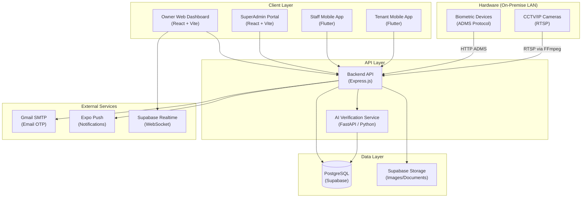

---

## 4. Frontend Architecture (Owner Web Dashboard)

### 4.1 Application Structure

```
frontend/src/
├── App.jsx                    # Root component with all routes
├── main.jsx                   # ReactDOM entry point
├── index.css                  # Global styles + CSS variables
├── App.css                    # App-level styles
├── services/
│   ├── api.js                 # Axios instance with interceptors
│   └── supabase.js            # Supabase client + Realtime subscriptions
├── contexts/
│   ├── ThemeContext.jsx        # Dark/light theme provider
│   ├── FeatureContext.jsx      # License feature gate provider
│   └── NotificationContext.jsx # SSE-driven toast notifications
├── components/
│   ├── common/
│   │   ├── FeatureGuard.jsx    # Feature-gated rendering
│   │   └── MobileGuard.jsx     # Redirects mobile browsers to app stores
│   └── layouts/
│       └── AppLayout.jsx       # Sidebar + header + ProtectedRoute
├── features/
│   ├── auth/                   # LoginPage, RegisterPage, VerifyEmailPage, ActivationPage
│   ├── dashboard/              # Main dashboard with metrics
│   ├── tenants/                # Tenant CRUD + TenantDetailsPage + BiometricModals
│   ├── rooms/                  # Room/Floor/Bed management
│   ├── payments/               # Payment recording + history
│   ├── staff/                  # Staff management
│   ├── devices/                # Biometric device management
│   ├── schedules/              # Access schedule configuration
│   ├── reports/                # Reports + TenantAttendance
│   ├── expenses/               # Expense tracker
│   ├── mess/                   # Mess menu + QR scan
│   ├── visitors/               # Visitor pass management
│   ├── tickets/                # Support tickets (admin + public)
│   ├── notifications/          # In-app notification center
│   ├── communication/          # WhatsApp/SMS settings
│   ├── cctv/                   # CCTV AI face recognition dashboard
│   ├── backups/                # Database backup management
│   ├── website/                # Public website profile editor
│   ├── tenant_verification/    # AI-powered tenant face verification
│   └── tenant_self_registration/ # QR-based self-registration admin
└── pages/
    ├── BookVisit.jsx           # Public visitor booking form
    ├── TenantSelfRegistrationPage.jsx  # Public self-registration
    └── TenantVerificationPage.jsx      # Inline verification view
```

### 4.2 Frontend Architecture Diagram

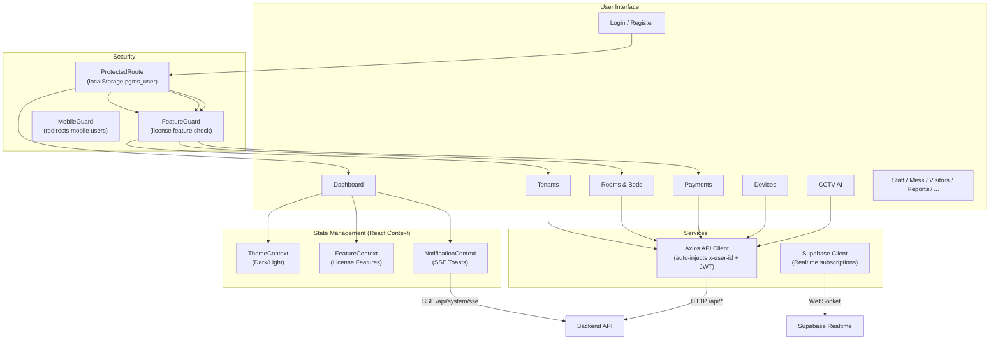

### 4.3 Authentication Flow (Frontend)
- User data stored in `localStorage` under key `pgms_user`
- Contains: `user_id`, `token` (JWT), `features[]`, `is_activated`, `activation_code`
- Axios interceptor auto-attaches `Authorization: Bearer <token>` and `x-user-id` headers
- 401 responses trigger auto-logout and redirect to `/login`
- Features fetched from `/api/auth/features` on app load, cached in context

### 4.4 Real-time Features
- **Supabase Realtime:** `subscribeToTable()` in [supabase.js](file:///c:/Users/chand/OneDrive/Desktop/PGMS/frontend/src/services/supabase.js) subscribes to `postgres_changes` events on any table
- **SSE (Server-Sent Events):** `NotificationContext` connects to `/api/system/sse?userId=X` for live activity toast notifications (ADMS punches, payment events, access alerts)

---

## 5. Backend Architecture

### 5.1 Module Structure

```
backend/src/
├── app.js                     # Express app config, middleware, route mounting
├── server.js                  # HTTP server + background job registration
├── config/
│   ├── index.js               # Central config (port, JWT secret, admin key)
│   ├── database.js            # Knex.js connection (PostgreSQL via Supabase)
│   └── supabase.js            # Supabase JS client (for Storage API)
├── middleware/
│   ├── auth.js                # extractUser (JWT + x-user-id multi-tenant)
│   ├── featureAuth.js         # requireFeature (license feature gating)
│   ├── superAdminAuth.js      # requireSuperAdmin (JWT role check)
│   ├── tenantAuth.js          # tenantAuth (x-tenant-id header)
│   ├── adminAuth.js           # isAdmin (x-admin-key API key)
│   ├── rateLimiter.js         # 6 rate limiters (register, login, OTP, etc.)
│   ├── inputSanitizer.js      # XSS/HTML injection prevention
│   ├── requestLogger.js       # ADMS protocol debug logging
│   ├── errorHandler.js        # asyncHandler + globalErrorHandler
│   └── emailSecurity.js       # Email domain validation
├── modules/                   # 29 feature modules (routes + controller + service)
│   ├── auth/                  # Registration, login, OTP, activation, features
│   ├── tenants/               # Tenant CRUD, allocation, vacate
│   ├── payments/              # Payment recording, history, billing
│   ├── rooms/                 # Room management
│   ├── beds/                  # Bed management
│   ├── floors/                # Floor management
│   ├── staff/                 # Staff CRUD, attendance, leaves
│   ├── devices/               # Biometric device management + ADMS protocol
│   │   └── adms/              # ADMS controller, parser, service, utils, routes
│   ├── biometrics/            # Biometric template management
│   ├── access-control/        # Access rules, schedules, groups, holidays, enforcement
│   ├── licenses/              # License management + permission resolution
│   ├── notifications/         # In-app notifications + push
│   ├── communication/         # WhatsApp/SMS gateway settings + queue
│   ├── events/                # Activity event logging
│   ├── reports/               # Analytics and report generation
│   ├── expenses/              # Expense tracking
│   ├── mess/                  # Mess menu, scan, meal tracking
│   ├── visitors/              # Visitor passes + entry/exit
│   ├── leads/                 # Lead/inquiry management
│   ├── tickets/               # Support ticket system
│   ├── billing/               # Invoice/billing module
│   ├── website/               # Public website profile
│   ├── backup/                # Database backup service
│   ├── superadmin/            # SuperAdmin client management
│   ├── system/                # System config, migrations, SSE, activity logs
│   ├── roles/                 # App roles + device pairing
│   ├── structure-builder/     # Multi-branch property structure
│   ├── tenant-app/            # Tenant mobile app endpoints
│   └── app-version/           # Mobile app version checking
├── controllers/               # Legacy controllers (camera, face, image, registration, verification)
├── routes/                    # Legacy route files (camera, face, image, public, registration, verification)
├── services/
│   ├── email.service.js       # Nodemailer Gmail SMTP (OTP emails)
│   ├── streamService.js       # FFmpeg RTSP→HLS conversion
│   └── verification.service.js # AI face verification orchestration
├── jobs/
│   ├── rentReminders.js       # Daily rent reminder notifications
│   ├── communicationJob.js    # Daily WhatsApp/SMS queue generation
│   └── backupJob.js           # Scheduled database backups
├── shared/
│   └── events.js              # Global EventEmitter bus for SSE
└── utils/
    └── supabaseClient.js      # Supabase client for storage operations
```

### 5.2 Request Processing Pipeline

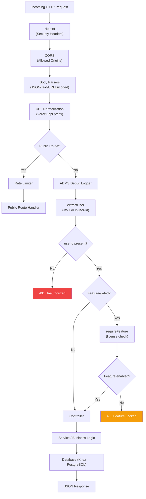

### 5.3 Background Jobs

| Job | File | Schedule | Purpose |
|-----|------|----------|---------|
| Rent Reminders | [rentReminders.js](file:///c:/Users/chand/OneDrive/Desktop/PGMS/backend/src/jobs/rentReminders.js) | Every 24h | Sends push notifications for upcoming/overdue rent. Auto-purges 7-day-old notifications. |
| Communication Queue | [communicationJob.js](file:///c:/Users/chand/OneDrive/Desktop/PGMS/backend/src/jobs/communicationJob.js) | Every 24h | Generates WhatsApp/SMS reminder queue for enabled users |
| Database Backup | [backupJob.js](file:///c:/Users/chand/OneDrive/Desktop/PGMS/backend/src/jobs/backupJob.js) | Every 24h | Runs automated database backup (configurable via `BACKUP_INTERVAL_HOURS`) |
| Access Enforcement | [access.service.js](file:///c:/Users/chand/OneDrive/Desktop/PGMS/backend/src/modules/access-control/access.service.js) | Cron (startEnforcementJob) + Vercel Cron `0 0 * * *` | Enforces expiry rules — blocks expired tenants from biometric access |

> [!NOTE]
> Background jobs run only in local/non-Vercel mode (`!config.isVercel`). On Vercel, enforcement runs via Vercel Cron at `/api/cron/enforce`.

---

## 6. Database Architecture

### 6.1 Database Technology
- **Engine:** PostgreSQL (hosted on Supabase)
- **Query Builder:** Knex.js (migration-based schema management)
- **Connection:** Supabase Pooler (PgBouncer), SSL enabled
- **Connection Pool:** min=0, max=10, with keepAlive

### 6.2 Entity Relationship Diagram

```mermaid
erDiagram
    USERS {
        int user_id PK
        string email UK
        string password_hash
        string display_name
        string pg_name
        string pg_address
        string pg_city
        string pg_logo
        string mobile
        boolean is_activated
        string activation_code
        string license_key
        boolean email_verified
        string email_otp
        timestamp email_otp_expires
        timestamp license_expiry
    }
    
    LICENSES {
        int license_id PK
        int user_id FK
        string license_key UK
        string product_id
        string status
        int max_tenants
        int max_staff
        json features
        timestamp expires_at
        timestamp created_at
    }
    
    SUPER_ADMINS {
        int id PK
        string email UK
        string password_hash
        string name
    }

    FLOORS {
        int floor_id PK
        string floor_name
        int user_id FK
    }
    
    ROOMS {
        int room_id PK
        int floor_id FK
        string room_number
        int sharing_capacity
        string ac_type
        int user_id FK
    }
    
    BEDS {
        int bed_id PK
        int room_id FK
        string bed_number
        float bed_cost
        float daily_cost
        float weekly_cost
        float advance_amount
        string status
        int user_id FK
    }
    
    TENANTS {
        int tenant_id PK
        int bed_id FK
        string name
        string mobile
        string email
        string occupation
        string gender
        string proof_doc_url
        date joining_date
        date expiry_date
        string tenant_type
        string status
        string face_encoding
        text face_encodings
        string biometric_pin
        float custom_rent
        date advance_vacate_date
        string expo_push_token
        int user_id FK
    }
    
    PAYMENTS {
        int payment_id PK
        int tenant_id FK
        date payment_date
        float amount_paid
        float balance
        string payment_type
        string utr_number
        string payment_via
        float rent_charged
        string for_month
        string transaction_group_id
        json bed_snapshot
        int user_id FK
    }
    
    STAFF {
        int staff_id PK
        string name
        string mobile
        string role
        string trade_type
        string shift
        int shift_grace_minutes
        boolean is_available
        string password_hash
        string photo
        boolean has_admin_privilege
        int admin_user_id FK
    }
    
    DEVICES {
        int device_id PK
        string device_name
        string serial_number UK
        string comm_key
        boolean adms_status
        string url
        string ip_address
        json sdk_options
        timestamp last_seen
        int user_id FK
    }
    
    ACCESS_CONTROL {
        int rule_id PK
        int tenant_id FK
        int device_id FK
        boolean access_granted
        date expiry_rule_date
    }
    
    ACCESS_SCHEDULES {
        int schedule_id PK
        string name
        json time_ranges
        json daywise_timings
        int user_id FK
    }
    
    ACCESS_GROUPS {
        int group_id PK
        string name
        int schedule_id FK
        json tenant_ids
        int user_id FK
    }
    
    ATTENDANCE_LOGS {
        int log_id PK
        int tenant_id FK
        timestamp punch_time
        int punch_state
        string device_sn
        int user_id FK
    }
    
    BIOMETRIC_TEMPLATES {
        int template_id PK
        int tenant_id FK
        string type
        text template_data
        json metadata
        int user_id FK
    }
    
    NOTIFICATIONS {
        int notification_id PK
        int user_id FK
        int tenant_id FK
        string title
        text body
        string type
        boolean is_read
        timestamp created_at
    }
    
    VISITORS {
        int visitor_id PK
        string name
        string phone
        date visit_date
        string purpose
        string status
        string pass_code
        string visitor_type
        string source
        int user_id FK
        int tenant_id FK
    }
    
    TICKETS {
        int ticket_id PK
        int tenant_id FK
        string issue_category
        text description
        string status
        int rating
        string feedback
        int user_id FK
        timestamp created_at
    }
    
    EXPENSES {
        int expense_id PK
        string category
        float amount
        string description
        date expense_date
        int user_id FK
    }
    
    MESS_MENUS {
        int menu_id PK
        string day
        string meal_type
        text items
        int user_id FK
    }
    
    COMMUNICATION_SETTINGS {
        int id PK
        int user_id FK
        string channel
        boolean enabled
        json config
    }
    
    LEADS {
        int lead_id PK
        string name
        string mobile
        string source
        string status
        int user_id FK
    }
    
    TENANT_BED_HISTORY {
        int id PK
        int tenant_id FK
        int bed_id FK
        date start_date
        date end_date
    }
    
    TENANT_REGISTRATIONS {
        int id PK
        string name
        string mobile
        string status
        text face_images
        text face_encodings
        int tenant_id FK
        int user_id FK
    }
    
    TENANT_EMBEDDINGS {
        int id PK
        int tenant_id FK
        text embedding
        text face_encodings
    }
    
    SYSTEM_CONFIG {
        int id PK
        string key UK
        text value
    }
    
    ENTRY_EXIT_LOGS {
        int id PK
        int tenant_id FK
        boolean is_known
        float match_confidence
        string source
        timestamp timestamp
    }
    
    APP_ROLES {
        int id PK
        string role_name
        json permissions
        int user_id FK
    }
    
    DEVICE_PAIRINGS {
        int id PK
        string pairing_code
        int device_id FK
        int user_id FK
    }
    
    STAFF_LEAVES {
        int id PK
        int staff_id FK
        date start_date
        date end_date
        string reason
        string status
    }
    
    PG_PROPERTIES {
        int id PK
        string name
        text description
        string address
        string google_map_url
        string contact_phone
        string contact_email
        int user_id FK
    }
    
    UNKNOWN_DEVICE_LOGS {
        int id PK
        string device_sn
        text raw_data
        timestamp created_at
    }
    
    MESSAGE_LOGS {
        int message_id PK
        int user_id FK
        int tenant_id FK
        string channel
        string recipient
        text message_text
        string status
    }
    
    USERS ||--o{ LICENSES : "has"
    USERS ||--o{ FLOORS : "owns"
    USERS ||--o{ ROOMS : "owns"
    USERS ||--o{ BEDS : "owns"
    USERS ||--o{ TENANTS : "manages"
    USERS ||--o{ STAFF : "employs"
    USERS ||--o{ DEVICES : "owns"
    FLOORS ||--o{ ROOMS : "contains"
    ROOMS ||--o{ BEDS : "contains"
    BEDS ||--o{ TENANTS : "assigned to"
    TENANTS ||--o{ PAYMENTS : "makes"
    TENANTS ||--o{ ACCESS_CONTROL : "has rules"
    TENANTS ||--o{ ATTENDANCE_LOGS : "recorded in"
    TENANTS ||--o{ BIOMETRIC_TEMPLATES : "enrolled with"
    TENANTS ||--o{ TICKETS : "submits"
    TENANTS ||--o{ VISITORS : "receives"
    TENANTS ||--o{ TENANT_BED_HISTORY : "moved through"
    DEVICES ||--o{ ACCESS_CONTROL : "controls"
```

### 6.3 Multi-Tenant Data Isolation

Data isolation is achieved through **`user_id` column filtering** on virtually every table. Each PG owner (user) can only access rows where `user_id` matches their authenticated identity.

```
users.user_id = 5  →  floors WHERE user_id=5
                   →  rooms WHERE user_id=5
                   →  beds WHERE user_id=5
                   →  tenants WHERE user_id=5
                   →  payments WHERE user_id=5
                   →  devices WHERE user_id=5
                   →  staff WHERE admin_user_id=5
```

> [!IMPORTANT]
> Row Level Security (RLS) policies exist at the Supabase level (see migration [20260904183000_secure_users_rls.js](file:///c:/Users/chand/OneDrive/Desktop/PGMS/backend/migrations/20260904183000_secure_users_rls.js)), supplementing the application-layer `user_id` filtering.

---

## 7. Authentication & Authorization Architecture

### 7.1 Authentication Flow

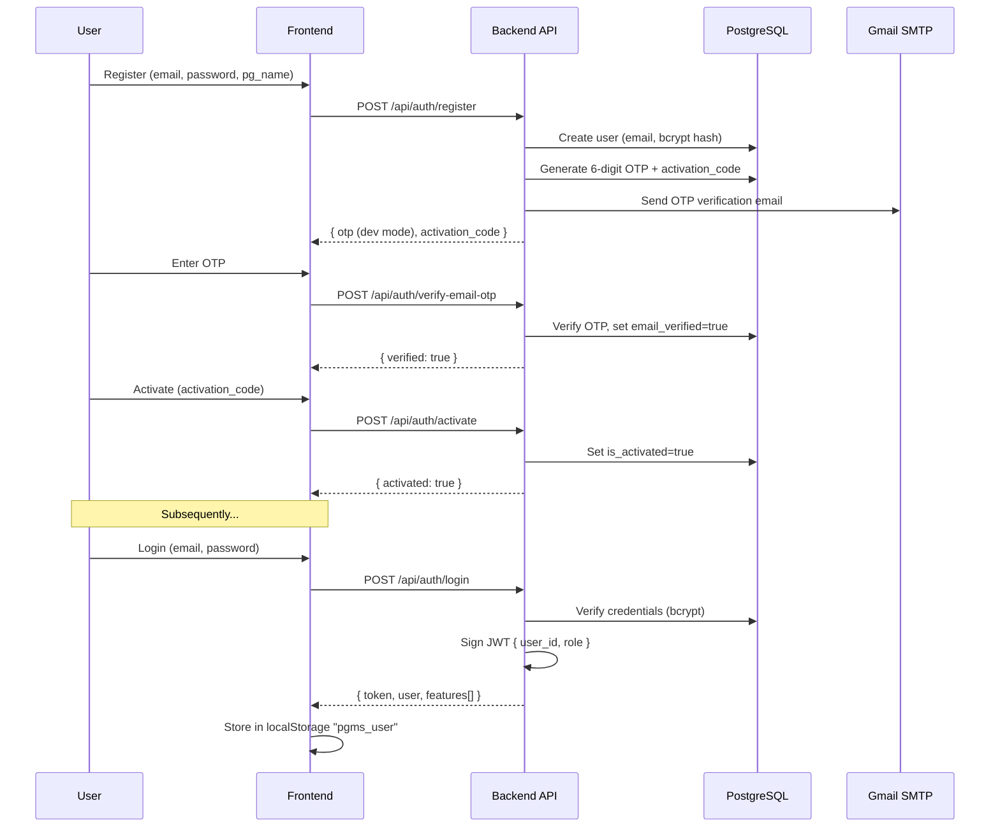

### 7.2 Auth Mechanisms by Application

| Application | Login Endpoint | Auth Method | Token Storage |
|------------|---------------|-------------|---------------|
| Owner Web | `POST /api/auth/login` | Email + Password → JWT | localStorage `pgms_user` |
| SuperAdmin | `POST /api/superadmin/login` | Email + Password → JWT | localStorage `superadmin_token` |
| Staff App | `POST /api/staff/login` | Mobile + Password/PIN → JWT | flutter_secure_storage |
| Tenant App | `POST /api/tenant/auth/login` | Mobile + PIN → Token | flutter_secure_storage |

### 7.3 Authorization Layers

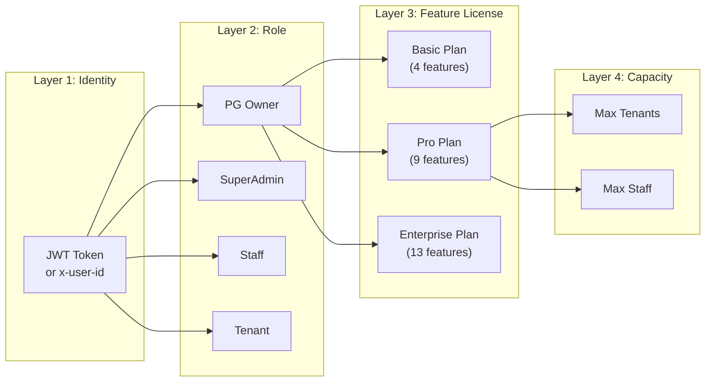

### 7.4 Middleware Stack

| Middleware | File | Purpose |
|-----------|------|---------|
| `extractUser` | [auth.js](file:///c:/Users/chand/OneDrive/Desktop/PGMS/backend/src/middleware/auth.js) | Extracts `userId` from JWT Bearer token, `x-user-id` header, or query param. Blocks protected routes without identity. |
| `requireFeature(key)` | [featureAuth.js](file:///c:/Users/chand/OneDrive/Desktop/PGMS/backend/src/middleware/featureAuth.js) | Checks if user's active license includes the required feature key. Returns 403 `FEATURE_LOCKED` if not. |
| `requireSuperAdmin` | [superAdminAuth.js](file:///c:/Users/chand/OneDrive/Desktop/PGMS/backend/src/middleware/superAdminAuth.js) | Verifies JWT has `role: 'superadmin'` and exists in `super_admins` table. |
| `tenantAuth` | [tenantAuth.js](file:///c:/Users/chand/OneDrive/Desktop/PGMS/backend/src/middleware/tenantAuth.js) | Validates `x-tenant-id` header against `tenants` table. |
| `isAdmin` | [adminAuth.js](file:///c:/Users/chand/OneDrive/Desktop/PGMS/backend/src/middleware/adminAuth.js) | Validates `x-admin-key` header matches configured admin API key. |
| Rate Limiters | [rateLimiter.js](file:///c:/Users/chand/OneDrive/Desktop/PGMS/backend/src/middleware/rateLimiter.js) | 6 limiters: register (6/hr), login (15/15min), OTP verify (10/15min), OTP resend (3/15min), superadmin (5/15min), public (200/15min) |
| `inputSanitizer` | [inputSanitizer.js](file:///c:/Users/chand/OneDrive/Desktop/PGMS/backend/src/middleware/inputSanitizer.js) | Strips HTML tags, `<script>`, `javascript:` pseudo-protocols, and inline event handlers from all request body/query/params. |
| `globalErrorHandler` | [errorHandler.js](file:///c:/Users/chand/OneDrive/Desktop/PGMS/backend/src/middleware/errorHandler.js) | Catches unhandled errors and returns standardized JSON error response. |

---

## 8. API Architecture

### 8.1 API Route Map

| Route Prefix | Module | Auth | Feature Gate | Description |
|-------------|--------|------|-------------|-------------|
| `POST /api/auth/*` | auth | Public (rate-limited) | — | Register, login, OTP, activate, features |
| `/api/floors` | floors | JWT/user_id | — | Floor CRUD |
| `/api/rooms` | rooms | JWT/user_id | — | Room CRUD |
| `/api/beds` | beds | JWT/user_id | — | Bed CRUD |
| `/api/tenants` | tenants | JWT/user_id | — | Tenant CRUD + allocation |
| `/api/payments` | payments | JWT/user_id | — | Payment recording + history |
| `/api/devices` | devices | JWT/user_id | `biometrics` | Biometric device management |
| `/api/biometric-templates` | biometrics | JWT/user_id | `biometrics` | Fingerprint/face template CRUD |
| `/api/access-control` | access-control | JWT/user_id | `biometrics` | Access rule management |
| `/api/access-schedules` | access-control | JWT/user_id | `biometrics` | Schedule configuration |
| `/api/access-groups` | access-control | JWT/user_id | `biometrics` | Group assignment |
| `/api/holidays` | access-control | JWT/user_id | `biometrics` | Holiday schedule |
| `/api/staff` | staff | JWT/user_id | `staff_roles` | Staff CRUD + attendance + leaves |
| `/api/expenses` | expenses | JWT/user_id | `expenses` | Expense tracker |
| `/api/mess` | mess | JWT/user_id | `mess_mgmt` | Mess menu + meal tracking |
| `/api/communication` | communication | JWT/user_id | `whatsapp_sms` | WhatsApp/SMS settings |
| `/api/cameras` | camera | JWT/user_id | `cctv_ai` | Camera CRUD |
| `/api/face` | face | JWT/user_id | `cctv_ai` | Face encoding operations |
| `/api/verify` | verification | JWT/user_id | `tenant_verification` | AI face verification |
| `/api/registrations` | registration | JWT/user_id | `tenant_verification` | Self-registration management |
| `/api/structure` | structure-builder | JWT/user_id | `multi_branch` | Multi-branch PG structure |
| `/api/roles` | roles | JWT/user_id | `staff_roles` | App role management |
| `/api/reports` | reports | JWT/user_id | — | Reports & analytics |
| `/api/licenses` | licenses | JWT/user_id | — | License info |
| `/api/admin` | billing, tickets, website | JWT/user_id | — | Admin operations |
| `/api/visitors` | visitors | JWT/user_id | — | Visitor management |
| `/api/leads` | leads | JWT/user_id | — | Lead tracking |
| `/api/notifications` | notifications | JWT/user_id | — | Notification center |
| `/api/events` | events | JWT/user_id | — | Activity event logs |
| `/api/system` | system, backup | JWT/user_id | — | Config, backups, SSE, migrations |
| `/api/tenant` | tenant-app | JWT/tenant-auth | — | Tenant mobile app APIs |
| `POST /api/staff/login` | staff | Public | — | Staff mobile login |
| `POST /api/tenant/auth/login` | tenant-app | Public | — | Tenant mobile login |
| `/api/superadmin` | superadmin | SuperAdmin JWT | — | Client management portal |
| `/api/public/*` | various | Public (rate-limited) | — | Public tickets, leads, mess scan, app version |
| `/iclock/*` | ADMS | Device (serial_number) | — | Biometric device protocol |
| `/api/cron/enforce` | access-control | Vercel Cron | — | Daily expiry enforcement |

### 8.2 ADMS Protocol (Biometric Device Communication)

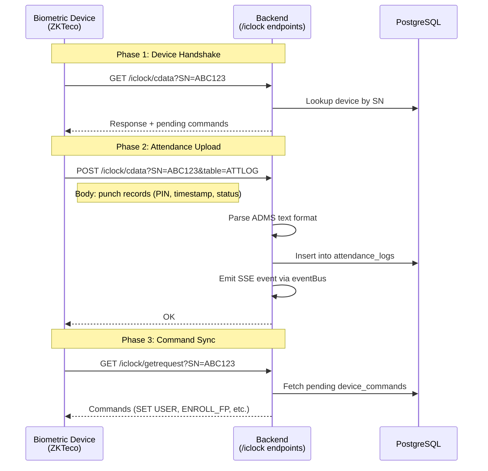

---

## 9. File & Storage Architecture

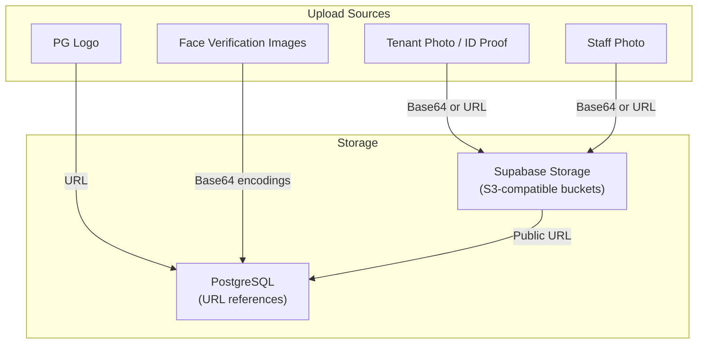

**Storage approach:**
- **Profile photos, ID proofs:** Stored as URLs in `proof_doc_url` (tenant), `photo` (staff), `pg_logo` (user). Actual files in Supabase Storage.
- **Face encodings:** Stored as text/JSON directly in database columns (`face_encoding`, `face_encodings` on tenants table; `template_data` on `biometric_templates`; `embedding` on `tenant_embeddings`).
- **PDF reports:** Generated on-the-fly using PDFKit, streamed directly to client (not persisted).
- **Database backups:** Generated as JSON exports via [backup.service.js](file:///c:/Users/chand/OneDrive/Desktop/PGMS/backend/src/modules/backup/backup.service.js).

---

## 10. Real-Time Architecture

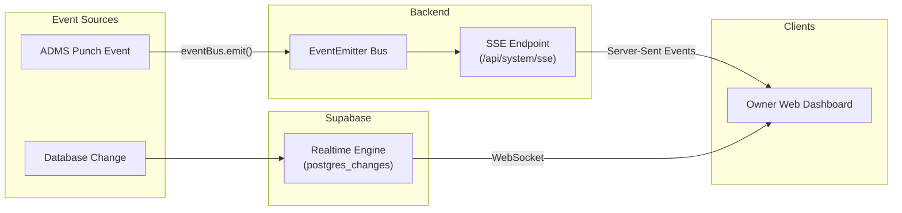

**Two parallel real-time channels:**
1. **SSE (Server-Sent Events):** Custom EventEmitter bus → `/api/system/sse` endpoint. Used for ADMS attendance events, creating live toast notifications.
2. **Supabase Realtime:** Frontend subscribes to `postgres_changes` via WebSocket. Used for auto-refreshing data grids when any row changes.

---

## 11. CCTV / Camera Architecture

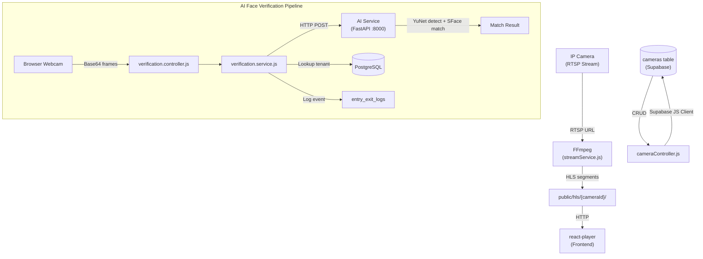

**Components:**
- **Camera management:** CRUD via [cameraController.js](file:///c:/Users/chand/OneDrive/Desktop/PGMS/backend/src/controllers/cameraController.js) using Supabase JS client
- **Stream conversion:** [streamService.js](file:///c:/Users/chand/OneDrive/Desktop/PGMS/backend/src/services/streamService.js) spawns FFmpeg for RTSP → HLS
- **AI face verification:** [verification.service.js](file:///c:/Users/chand/OneDrive/Desktop/PGMS/backend/src/services/verification.service.js) orchestrates face matching against registered tenant encodings
- **AI microservice:** [ai-service/](file:///c:/Users/chand/OneDrive/Desktop/PGMS/ai-service/app/app.py) runs YuNet (detection) + SFace (recognition) + LBP (anti-spoofing)

---

## 12. Biometric Device Architecture

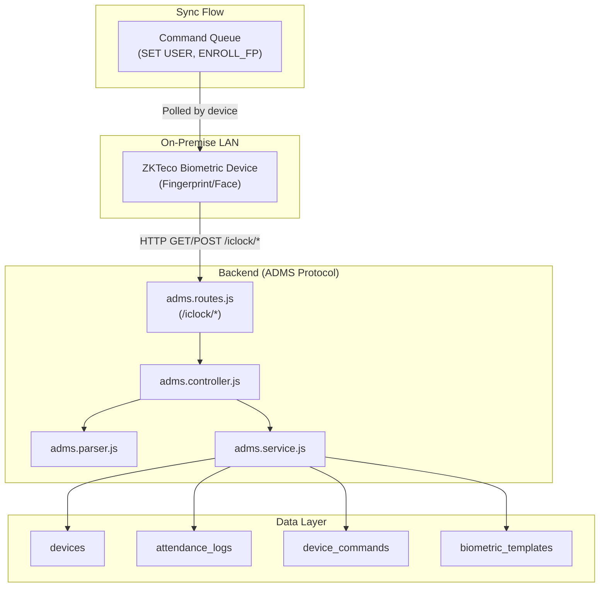

**Protocol:** ZKTeco ADMS (Automated Data Master Server) over HTTP
- Device polls `/iclock/cdata` for handshake and uploads
- Device polls `/iclock/getrequest` for pending commands
- Backend parses proprietary text format (PIN\tTimestamp\tStatus)
- Commands queued in `device_commands` table (user enrollment, fingerprint sync)
- Template synchronization via `biometric_templates` with delta sync support

---

## 13. Notification Architecture

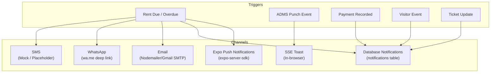

| Channel | Implementation | Status |
|---------|---------------|--------|
| **Expo Push** | expo-server-sdk, sends to tenant `expo_push_token` | ✅ Implemented |
| **SSE Toasts** | EventEmitter → `/api/system/sse` → browser toast | ✅ Implemented |
| **Database Notifications** | `notifications` table → fetched by apps | ✅ Implemented |
| **Email (OTP)** | Nodemailer via Gmail SMTP | ✅ Implemented |
| **WhatsApp** | Generates `wa.me` deep link with pre-filled message | ⚠️ Link-based only (no API) |
| **SMS** | Console logging only (`[SMS MOCK]`) | ❌ Mock/placeholder |

---

## 14. Multi-Tenant / Client Architecture

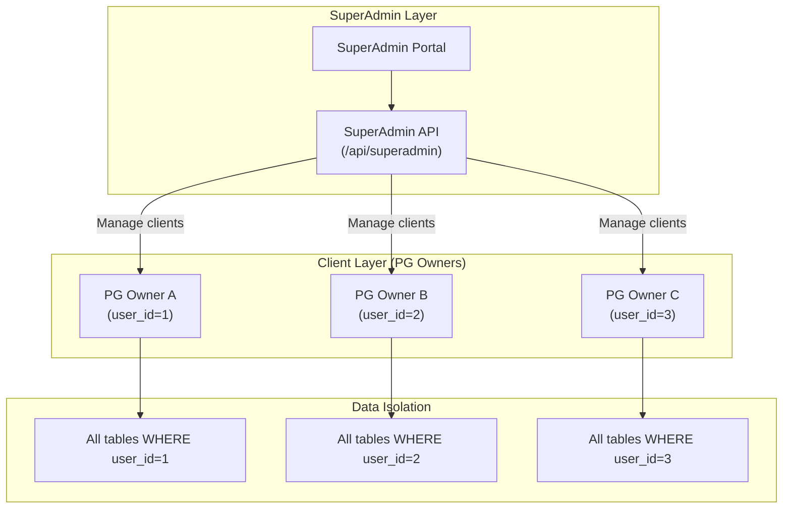

**Tenancy Model:** Shared database, row-level isolation via `user_id` column.

**Hierarchy per client:**
```
PG Owner (user)
  └── License (plan + features + capacity)
       ├── Floors
       │    └── Rooms
       │         └── Beds
       │              └── Tenants → Payments, Access, Attendance
       ├── Staff → Attendance, Leaves, Tickets
       ├── Devices → ADMS Protocol
       ├── Visitors
       ├── Mess Menu
       ├── Expenses
       └── Communication Settings
```

---

## 15. Feature License Architecture

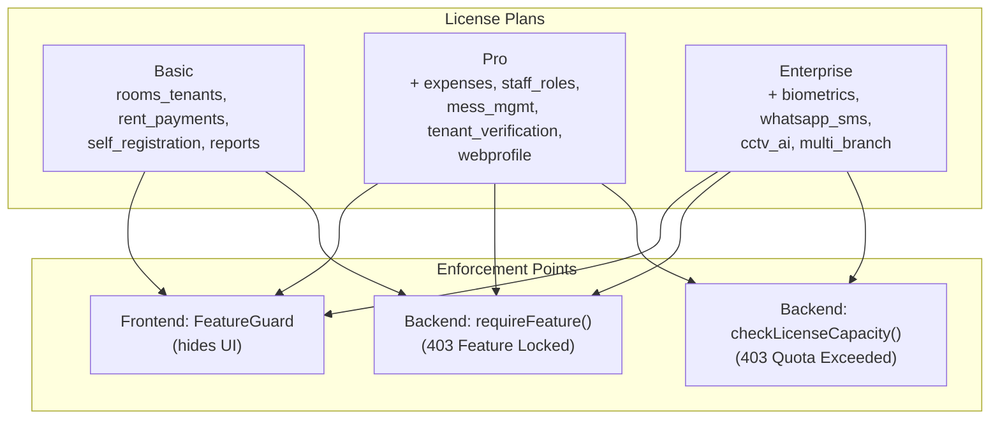

**13 licensable features** defined in [licensePermissions.service.js](file:///c:/Users/chand/OneDrive/Desktop/PGMS/backend/src/modules/licenses/licensePermissions.service.js):

| Feature Key | Category | Basic | Pro | Enterprise |
|------------|----------|:-----:|:---:|:----------:|
| `rooms_tenants` | Core | ✅ | ✅ | ✅ |
| `rent_payments` | Core | ✅ | ✅ | ✅ |
| `self_registration` | Core | ✅ | ✅ | ✅ |
| `reports` | Management | ✅ | ✅ | ✅ |
| `expenses` | Management | — | ✅ | ✅ |
| `staff_roles` | Management | — | ✅ | ✅ |
| `mess_mgmt` | Management | — | ✅ | ✅ |
| `tenant_verification` | Growth | — | ✅ | ✅ |
| `webprofile` | Growth | — | ✅ | ✅ |
| `biometrics` | Hardware/AI | — | — | ✅ |
| `whatsapp_sms` | Hardware/AI | — | — | ✅ |
| `cctv_ai` | Hardware/AI | — | — | ✅ |
| `multi_branch` | Hardware/AI | — | — | ✅ |

**Capacity limits:** `max_tenants` (default 50) and `max_staff` (default 20) per license.

---

## 16. Security Architecture

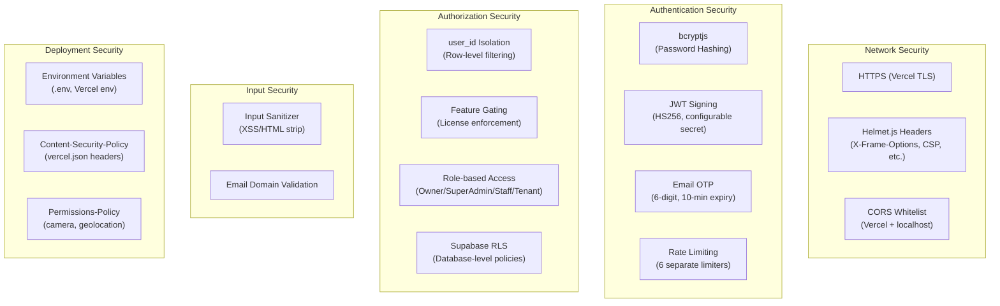

**Vercel Security Headers** (from [vercel.json](file:///c:/Users/chand/OneDrive/Desktop/PGMS/vercel.json)):
- `X-Content-Type-Options: nosniff`
- `X-Frame-Options: DENY`
- `Referrer-Policy: strict-origin-when-cross-origin`
- `Permissions-Policy: geolocation=(self), camera=(self), microphone=()`
- `Content-Security-Policy` with strict `connect-src` for Supabase domains

---

## 17. Deployment Architecture

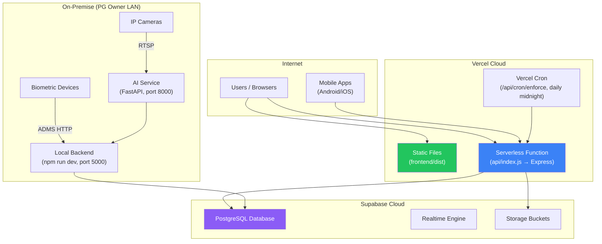

**Deployment Modes:**

| Component | Production | Development |
|-----------|-----------|-------------|
| Owner Frontend | Vercel (static, `frontend/dist`) | Vite dev server `:5173` |
| SuperAdmin Frontend | Separate Vercel deploy | Vite dev server `:5175` |
| Backend API | Vercel Serverless (`api/index.js`) | Node.js `:5000` |
| AI Service | Standalone Python server `:8000` | Uvicorn `:8000` |
| Database | Supabase PostgreSQL (cloud) | Same (no local SQLite in practice) |
| Staff/Tenant Apps | App Store / Play Store via Shorebird | Flutter emulator |

**Vercel Configuration** ([vercel.json](file:///c:/Users/chand/OneDrive/Desktop/PGMS/vercel.json)):
- `outputDirectory: frontend/dist` — serves built React app
- Rewrites: `/api/*` → `api/index.js` (Express serverless function)
- Rewrites: `/iclock/*` → `api/index.js` (ADMS device protocol)
- Cron: `0 0 * * *` → `/api/cron/enforce` (daily access enforcement)

---

## 18. Network Architecture

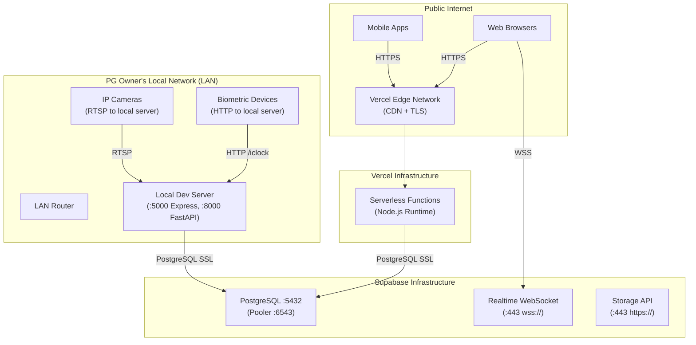

> [!WARNING]
> Biometric devices communicate via plain HTTP to a local backend instance. They cannot reach Vercel serverless functions directly because ADMS protocol requires persistent connections and the device firmware typically supports only LAN HTTP endpoints.

---

## 19. Data Flow Diagrams

### 19.1 Level 0 — System Context

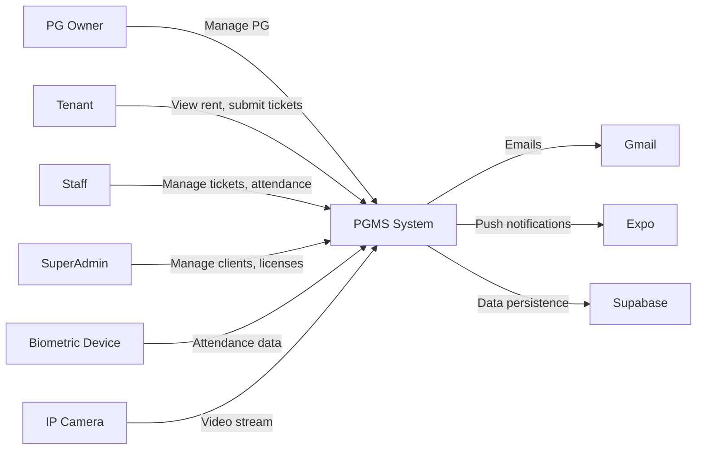

### 19.2 Tenant Registration Flow

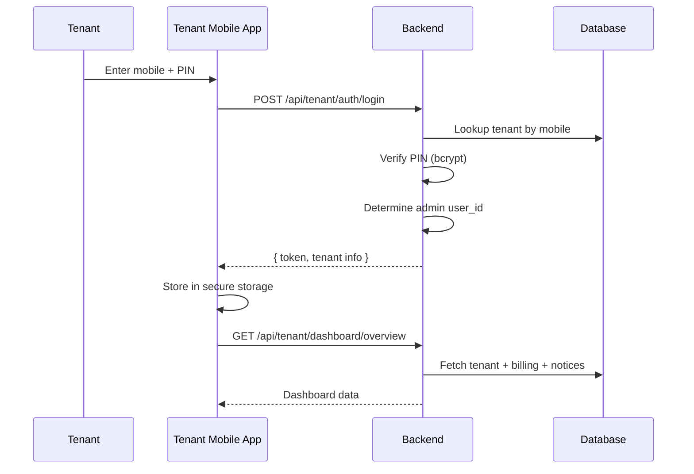

### 19.3 Payment Recording Flow

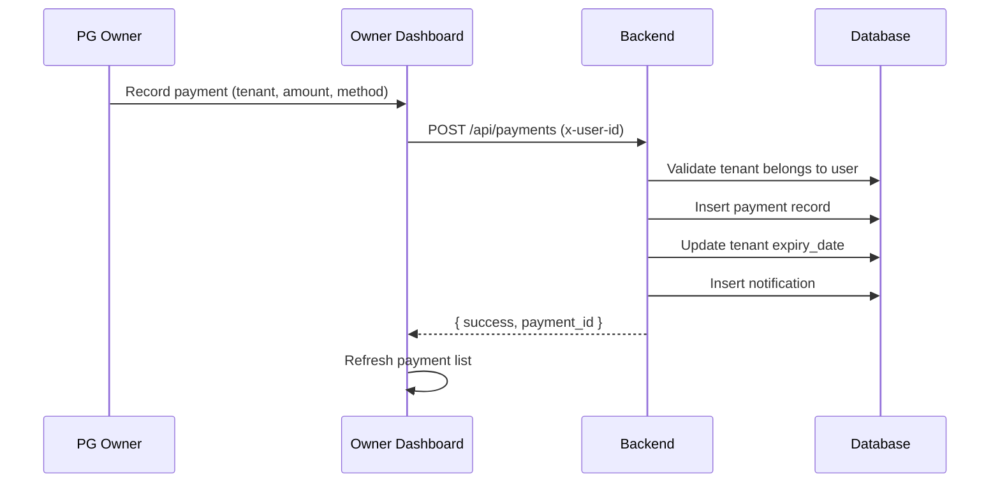

### 19.4 Biometric Attendance Flow

```mermaid
sequenceDiagram
    participant DEV as ZKTeco Device
    participant BE as Backend (ADMS)
    participant DB as Database
    participant SSE as SSE Event Bus
    participant FE as Owner Dashboard

    DEV->>BE: POST /iclock/cdata?SN=ABC&table=ATTLOG
    Note right of DEV: PIN=5 TIME=2026-09-11 09:00 STATUS=0
    BE->>BE: Parse ADMS text format
    BE->>DB: Lookup device by SN → get user_id
    BE->>DB: Resolve PIN → tenant_id
    BE->>DB: Insert attendance_log
    BE->>DB: Check access schedule (allowed time?)
    BE->>SSE: eventBus.emit('activity', event)
    SSE-->>FE: SSE event → toast notification
    BE-->>DEV: OK
```

---

## 20. End-to-End Request Flow

**Example: PG Owner adds a new tenant**

```mermaid
graph TB
    A["Owner clicks 'Add Tenant'<br/>in Tenants page"] --> B["Frontend sends<br/>POST /api/tenants<br/>with x-user-id + JWT"]
    B --> C["Express middleware chain:<br/>1. Helmet<br/>2. CORS<br/>3. Body parser<br/>4. extractUser (auth.js)<br/>5. inputSanitizer"]
    C --> D["tenants.routes.js<br/>→ tenants.controller.js"]
    D --> E["checkLicenseCapacity(userId, 'tenants')<br/>→ verify tenant quota"]
    E --> F["tenants.service.js<br/>→ INSERT INTO tenants"]
    F --> G["UPDATE beds SET status='Occupied'<br/>INSERT INTO tenant_bed_history"]
    G --> H["If biometric device:<br/>Queue SET USER command<br/>in device_commands"]
    H --> I["Response: { tenant_id, name, ... }"]
    I --> J["Frontend refreshes<br/>tenant list via GET /api/tenants"]
```

**Code trace:**
- Frontend trigger: [`Tenants.jsx`](file:///c:/Users/chand/OneDrive/Desktop/PGMS/frontend/src/features/tenants/Tenants.jsx)
- API call: `POST /api/tenants` → [tenants.routes.js](file:///c:/Users/chand/OneDrive/Desktop/PGMS/backend/src/modules/tenants/tenants.routes.js)
- Controller: [tenants.controller.js](file:///c:/Users/chand/OneDrive/Desktop/PGMS/backend/src/modules/tenants/tenants.controller.js)
- Capacity check: [licensePermissions.service.js](file:///c:/Users/chand/OneDrive/Desktop/PGMS/backend/src/modules/licenses/licensePermissions.service.js) → `checkLicenseCapacity()`
- Database: `tenants`, `beds`, `tenant_bed_history`, `device_commands` tables

---

## 21. Error & Failure Architecture

| Failure Scenario | Handling | Location |
|-----------------|----------|----------|
| **Database unavailable** | Connection error logged; startup prints diagnostic. Pool retries with timeout. | [database.js](file:///c:/Users/chand/OneDrive/Desktop/PGMS/backend/src/config/database.js) |
| **API request fails (client)** | 401 → auto-logout. Other errors → error message in UI. | [api.js](file:///c:/Users/chand/OneDrive/Desktop/PGMS/frontend/src/services/api.js) |
| **AI service offline** | Fallback to first registered candidate with simulated confidence. | [verification.service.js](file:///c:/Users/chand/OneDrive/Desktop/PGMS/backend/src/services/verification.service.js) L122-127 |
| **Biometric device offline** | Commands queue in `device_commands`; synced when device reconnects. | ADMS protocol (polling-based) |
| **Email send fails** | Fallback to console simulator mode (logs OTP to server console). | [email.service.js](file:///c:/Users/chand/OneDrive/Desktop/PGMS/backend/src/services/email.service.js) L62-76 |
| **Push notification fails** | Error caught and logged; notification still inserted into DB. | [rentReminders.js](file:///c:/Users/chand/OneDrive/Desktop/PGMS/backend/src/jobs/rentReminders.js) L57-59 |
| **Unhandled backend error** | `globalErrorHandler` catches, logs method+path+message, returns 500 JSON. | [errorHandler.js](file:///c:/Users/chand/OneDrive/Desktop/PGMS/backend/src/middleware/errorHandler.js) |
| **Supabase Realtime fails** | Silent catch; unsubscribe handler returns no-op function. | [supabase.js](file:///c:/Users/chand/OneDrive/Desktop/PGMS/frontend/src/services/supabase.js) L32-33 |
| **FFmpeg stream crash** | Process exit logged; `activeStreams` map cleaned up. | [streamService.js](file:///c:/Users/chand/OneDrive/Desktop/PGMS/backend/src/services/streamService.js) L46-49 |

> [!CAUTION]
> **Missing failure handling identified:**
> - No circuit breaker or retry logic for database connections
> - No dead-letter queue for failed notifications
> - No health-check monitoring for AI service or biometric devices
> - No alerting mechanism for critical failures

---

## 22. Observability

| Category | Implementation | Location |
|----------|---------------|----------|
| **Request Logging** | ADMS protocol requests logged to `adms_packets.log` file (local mode) or `console.log` (Vercel) | [requestLogger.js](file:///c:/Users/chand/OneDrive/Desktop/PGMS/backend/src/middleware/requestLogger.js) |
| **Error Logging** | `console.error()` throughout codebase | All modules |
| **Activity Audit** | `activity_logs` / `entry_exit_logs` tables | events module, verification service |
| **Database Logs** | Knex debug logs (when enabled) | — |
| **Performance Monitoring** | Not implemented | — |
| **External Monitoring** | Not implemented | — |
| **Analytics** | Dashboard metrics computed on-demand from database | reports module |

> [!WARNING]
> No structured logging framework, no APM integration, no external error tracking (Sentry, etc.).

---

## 23. CI/CD & Development Architecture

```mermaid
graph LR
    DEV["Developer"] -->|"git push"| GIT["Git Repository"]
    GIT -->|"Auto-deploy"| VERCEL_CI["Vercel<br/>(Build + Deploy)"]
    VERCEL_CI -->|"npm run build (frontend)"| STATIC_D["Static Deploy"]
    VERCEL_CI -->|"Serverless bundle"| LAMBDA_D["API Deploy"]
    
    DEV -->|"shorebird patch"| SHOREBIRD["Shorebird<br/>(OTA Updates)"]
    SHOREBIRD --> MOBILE_D["Mobile App Update"]
```

| Aspect | Implementation |
|--------|---------------|
| **Version Control** | Git (3 separate repositories) |
| **Frontend Build** | `vite build` → `frontend/dist` |
| **Backend Deploy** | Vercel Serverless via `api/index.js` entrypoint |
| **Database Migrations** | `knex migrate:latest` (manual or `npm run build`) |
| **Mobile OTA** | Shorebird Code Push (both Staff and Tenant apps) |
| **Automated Tests** | ❌ Not implemented (`echo "Error: no test specified"`) |
| **CI Pipeline** | Vercel auto-deploys on push (implicit) |
| **Staging Environment** | Not configured (dev → production) |

---

## 24. Mobile App Architecture

### 24.1 Staff Mobile App (Flutter)

```
Staff-PGMS/lib/
├── main.dart                  # App entry point
├── app.dart                   # MaterialApp + GoRouter setup
├── config/
│   └── api_config.dart        # Base URL configuration
├── features/
│   ├── auth/                  # Login screen
│   ├── attendance/            # Clock in/out + history
│   ├── tickets/               # Assigned ticket management
│   ├── leaves/                # Leave request/history
│   ├── profile/               # Profile + settings
│   ├── scan/                  # QR visitor scan
│   └── shell/                 # Bottom navigation shell
├── models/
│   ├── user.dart
│   ├── ticket.dart
│   ├── attendance.dart
│   └── leave.dart
├── providers/                 # Provider state management
├── services/
│   └── api_service.dart       # HTTP API client
├── theme/                     # App theme definitions
└── widgets/                   # Reusable UI components
```

**Staff App API Endpoints:**
- `POST /api/staff/login` — Mobile + password authentication
- `GET /api/staff/{id}/attendance` — Attendance log history
- `POST /api/staff/{id}/attendance/clock-in` — Manual clock-in
- `POST /api/staff/{id}/attendance/clock-out` — Manual clock-out
- `GET /api/staff/{id}/leaves` — Leave records
- `POST /api/staff/{id}/leave` — Submit leave request
- `GET /api/admin/staff/{id}/tickets` — Assigned tickets
- `PUT /api/admin/tickets/{id}` — Update ticket status
- `PUT /api/staff/{id}/update-pin` — Change login PIN
- `POST /api/staff/visitors/scan` — Scan visitor QR pass

### 24.2 Tenant Mobile App (Flutter)

```
Tenant-PGMS/lib/
├── main.dart                  # App entry point
├── app.dart                   # MaterialApp + GoRouter setup
├── config/
│   └── api_config.dart        # Base URL configuration
├── features/
│   ├── auth/                  # Login screen
│   ├── dashboard/             # Home dashboard
│   ├── payments/              # Billing + payment history
│   ├── support/               # Support tickets
│   ├── guests/                # Visitor pass management
│   ├── mess/                  # Mess menu + history
│   ├── logs/                  # Access log viewer
│   ├── notifications/         # Notification center
│   ├── profile/               # Profile + settings
│   └── shell/                 # Bottom navigation shell
├── models/
│   ├── tenant.dart, billing.dart, payment.dart
│   ├── ticket.dart, visitor.dart
│   ├── menu_item.dart, mess_history.dart
│   ├── log_entry.dart, notification.dart
├── providers/                 # Provider state management
├── services/
│   └── api_service.dart       # HTTP API client
├── theme/                     # App theme definitions
└── widgets/                   # Reusable UI components
```

**Tenant App API Endpoints:**
- `POST /api/tenant/auth/login` — Mobile + PIN authentication
- `GET /api/tenant/dashboard/overview` — Dashboard data
- `GET /api/tenant/payments/billing` — Current billing
- `GET /api/tenant/payments/history` — Payment history
- `POST /api/tenant/payments/record` — Record payment
- `GET /api/tenant/tickets` — Support tickets
- `POST /api/tenant/tickets/create` — Create ticket
- `GET /api/tenant/visitors` — Visitor list
- `POST /api/tenant/visitors` — Invite visitor
- `GET /api/tenant/mess/menu` — Mess menu
- `GET /api/tenant/logs` — Access logs
- `GET /api/tenant/notifications` — Notifications

---

## 25. Architecture-to-Code Mapping

### Component → File → Function → API → Database Table

| Component | Key File(s) | Key Function/Class | API Route | Primary Table(s) |
|-----------|-------------|-------------------|-----------|-----------------|
| **User Registration** | [auth.controller.js](file:///c:/Users/chand/OneDrive/Desktop/PGMS/backend/src/modules/auth/auth.controller.js) | `register()` | `POST /api/auth/register` | `users` |
| **Email OTP** | [email.service.js](file:///c:/Users/chand/OneDrive/Desktop/PGMS/backend/src/services/email.service.js) | `sendOtpEmail()` | `POST /api/auth/verify-email-otp` | `users` (email_otp) |
| **License Management** | [licensePermissions.service.js](file:///c:/Users/chand/OneDrive/Desktop/PGMS/backend/src/modules/licenses/licensePermissions.service.js) | `getUserActiveFeatures()`, `checkLicenseCapacity()` | `GET /api/auth/features` | `users`, `licenses` |
| **Feature Gate (Backend)** | [featureAuth.js](file:///c:/Users/chand/OneDrive/Desktop/PGMS/backend/src/middleware/featureAuth.js) | `requireFeature()` | Middleware on all gated routes | `licenses` |
| **Feature Gate (Frontend)** | [FeatureContext.jsx](file:///c:/Users/chand/OneDrive/Desktop/PGMS/frontend/src/contexts/FeatureContext.jsx) | `hasFeature()` | `GET /api/auth/features` | — |
| **Tenant CRUD** | `modules/tenants/` | Controller + Service | `/api/tenants` | `tenants`, `beds`, `tenant_bed_history` |
| **Payment Recording** | `modules/payments/` | Controller + Service | `/api/payments` | `payments` |
| **Room/Bed Management** | `modules/rooms/`, `modules/beds/` | Controller + Service | `/api/rooms`, `/api/beds` | `rooms`, `beds`, `floors` |
| **Staff Management** | `modules/staff/` | Controller + Service | `/api/staff` | `staff`, `attendance_logs`, `staff_leaves` |
| **Biometric Devices** | `modules/devices/adms/` | `adms.controller.js`, `adms.service.js` | `/iclock/*` | `devices`, `attendance_logs`, `device_commands` |
| **CCTV Cameras** | [cameraController.js](file:///c:/Users/chand/OneDrive/Desktop/PGMS/backend/src/controllers/cameraController.js) | `getCameras()`, `addCamera()` | `/api/cameras` | `cameras` (Supabase) |
| **Face Verification** | [verification.service.js](file:///c:/Users/chand/OneDrive/Desktop/PGMS/backend/src/services/verification.service.js) | `verifyLive()`, `verifyFace()` | `/api/verify/*` | `tenants`, `biometric_templates`, `tenant_embeddings`, `entry_exit_logs` |
| **AI Service** | [ai-service/app/app.py](file:///c:/Users/chand/OneDrive/Desktop/PGMS/ai-service/app/app.py) | FastAPI routes | `:8000/verify-live`, `:8000/verify-face` | — |
| **Stream Conversion** | [streamService.js](file:///c:/Users/chand/OneDrive/Desktop/PGMS/backend/src/services/streamService.js) | `startStream()` | Internal | — (FFmpeg → HLS files) |
| **SSE Real-time** | [events.js](file:///c:/Users/chand/OneDrive/Desktop/PGMS/backend/src/shared/events.js) + `system.controller.js` | `sseStream()` | `GET /api/system/sse` | — |
| **Supabase Realtime** | [supabase.js](file:///c:/Users/chand/OneDrive/Desktop/PGMS/frontend/src/services/supabase.js) | `subscribeToTable()` | WebSocket | Any table |
| **Rent Reminders** | [rentReminders.js](file:///c:/Users/chand/OneDrive/Desktop/PGMS/backend/src/jobs/rentReminders.js) | `sendRentReminders()` | Background job | `tenants`, `beds`, `notifications` |
| **Backup** | `modules/backup/` | `performBackup()` | `/api/system/backup` | All tables (export) |
| **SuperAdmin** | [superadmin.controller.js](file:///c:/Users/chand/OneDrive/Desktop/PGMS/backend/src/modules/superadmin/superadmin.controller.js) | Client management | `/api/superadmin` | `users`, `licenses`, `super_admins` |
| **Push Notifications** | [pushNotify.service.js](file:///c:/Users/chand/OneDrive/Desktop/PGMS/backend/src/modules/notifications/services/pushNotify.service.js) | `sendReminder()` | `/api/notifications/send` | `message_logs` |
| **Visitor Management** | `modules/visitors/` | Controller + Service | `/api/visitors` | `visitors` |
| **Mess Management** | `modules/mess/` | Controller + Service | `/api/mess` | `mess_menus`, `mess_scan_*` |
| **Expense Tracking** | `modules/expenses/` | Controller + Service | `/api/expenses` | `expenses` |
| **Support Tickets** | `modules/tickets/` | Controller + Service | `/api/admin/tickets`, `/api/public/tickets` | `tickets` |
| **Communication** | `modules/communication/` | Service | `/api/communication` | `communication_settings`, `message_logs` |
| **Reports** | `modules/reports/` | Controller + Service | `/api/reports` | Multiple (aggregate queries) |

---

## 26. Architecture Gaps & Risks

### CURRENT ARCHITECTURE — Identified Issues

> [!CAUTION]
> **Critical Security Risks**

| # | Risk | Severity | Details |
|---|------|----------|---------|
| 1 | **Credentials in source code** | 🔴 Critical | `.env` file contains production Supabase credentials, JWT secret, Gmail credentials committed to repo |
| 2 | **Weak JWT secret fallback** | 🔴 Critical | `config.jwtSecret || 'pgms_secret_key'` — hardcoded fallback secret |
| 3 | **x-user-id header bypass** | 🟡 High | Users can impersonate others by passing arbitrary `x-user-id` header on protected routes (JWT is not required if header is present) |
| 4 | **No CSRF protection** | 🟡 High | No CSRF tokens on state-changing requests |
| 5 | **SMS not implemented** | 🟢 Low | SMS reminders are console-logged only |

> [!WARNING]
> **Architectural Risks**

| # | Risk | Severity | Details |
|---|------|----------|---------|
| 6 | **No automated tests** | 🔴 Critical | Zero test coverage — `npm test` returns error |
| 7 | **No staging environment** | 🟡 High | Development deploys directly to production |
| 8 | **Single database** | 🟡 High | All clients share one PostgreSQL database, single point of failure |
| 9 | **No structured logging** | 🟡 Medium | All logging via `console.log/error` — no log aggregation or search |
| 10 | **No health monitoring** | 🟡 Medium | No uptime monitoring, no alerting |
| 11 | **Background jobs via setInterval** | 🟡 Medium | Not fault-tolerant; jobs don't survive process restarts on Vercel |
| 12 | **AI service fallback** | 🟡 Medium | When AI is offline, verification silently matches first registered tenant — potential security risk |
| 13 | **No database backup verification** | 🟡 Medium | Backups created but never tested for restore |
| 14 | **Master email whitelist** | 🟢 Low | `skyincolivingpg@gmail.com` has hardcoded Enterprise bypass in license service |
| 15 | **Mobile apps have mock data fallbacks** | 🟢 Low | API failures silently return hardcoded mock data — could mask real issues |

---

## 27. Recommended Future Improvements

> [!NOTE]
> These are recommendations based on the architecture analysis. None of these changes exist in the current codebase.

### Security
1. **Remove credentials from source code** — Use environment-only secrets, rotate all exposed credentials
2. **Enforce JWT-only authentication** — Remove `x-user-id` header fallback on protected routes
3. **Add CSRF protection** — Use `csurf` middleware or double-submit cookie pattern
4. **Implement refresh tokens** — Current JWT has no expiry handling visible

### Reliability
5. **Add automated testing** — Unit tests for services, integration tests for API routes
6. **Implement structured logging** — Winston/Pino with JSON output, shipped to log aggregation
7. **Add health monitoring** — `/health` endpoints with dependency checks, external uptime monitoring
8. **Use proper job scheduler** — Replace `setInterval` with Bull/BullMQ or Vercel Cron for all scheduled tasks

### Scalability
9. **Database connection pooling** — Consider PgBouncer transaction mode for serverless
10. **Add caching layer** — Redis/Upstash for frequently accessed data (features, schedules)
11. **CDN for static assets** — Already partially handled by Vercel, but user-uploaded images should use Supabase CDN

### Operations
12. **CI/CD pipeline** — GitHub Actions for linting, testing, and staged deployments
13. **Staging environment** — Separate Supabase project for pre-production testing
14. **Database migration safety** — Add migration rollback tests before production deployment
15. **API documentation** — Generate OpenAPI/Swagger spec from routes

---

## 28. Executive Summary Diagram

```mermaid
graph TB
    subgraph "Users"
        OWNER["🏠 PG Owner<br/>(Web Dashboard)"]
        SADMIN["👑 SuperAdmin<br/>(Admin Portal)"]
        STAFF_U["👷 Staff<br/>(Mobile App)"]
        TENANT_U["🏃 Tenant<br/>(Mobile App)"]
        PUBLIC["🌐 Public<br/>(Book Visit / Register)"]
    end
    
    subgraph "TheNextPG Platform"
        direction TB
        FE["React Web Apps<br/>(Owner + SuperAdmin)"]
        MOBILE["Flutter Mobile Apps<br/>(Staff + Tenant)"]
        API["Express.js Backend API<br/>(29 feature modules)"]
        AI["Python AI Service<br/>(Face Recognition)"]
        DB[("PostgreSQL<br/>(Supabase Cloud)")]
        STORE["File Storage<br/>(Supabase)"]
    end
    
    subgraph "Integrations"
        BIO_INT["Biometric Devices<br/>(ZKTeco ADMS)"]
        CAM_INT["IP Cameras<br/>(RTSP)"]
        EMAIL_INT["Email<br/>(Gmail SMTP)"]
        PUSH_INT["Push Notifications<br/>(Expo)"]
        WA_INT["WhatsApp<br/>(Deep Links)"]
    end
    
    OWNER --> FE
    SADMIN --> FE
    STAFF_U --> MOBILE
    TENANT_U --> MOBILE
    PUBLIC --> FE
    FE --> API
    MOBILE --> API
    API --> DB
    API --> STORE
    API --> AI
    API <--> BIO_INT
    API --> CAM_INT
    API --> EMAIL_INT
    API --> PUSH_INT
    API --> WA_INT
    
    style DB fill:#8b5cf6,color:#fff
    style API fill:#3b82f6,color:#fff
    style AI fill:#10b981,color:#fff
```

---

*This document was reverse-engineered from the actual PGMS codebase across three repositories (PGMS, Staff-PGMS, Tenant-PGMS) on 2026-09-11. Every component, API route, database table, and integration described here is traceable to existing source code. Items marked with ❌ or UNKNOWN indicate missing or unconfirmed implementations.*
